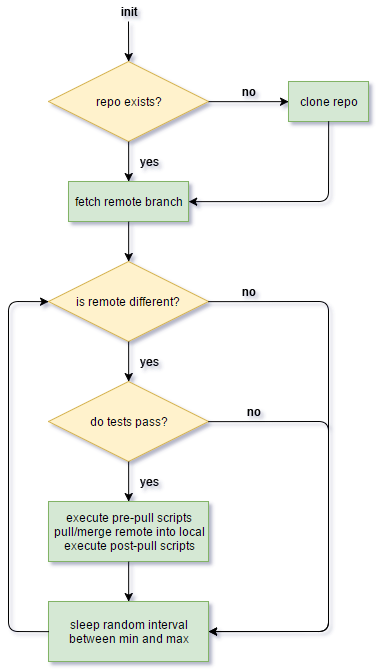

# Description

The purpose of this program is to auto-deploy any arbitrary program in a fashion that is more suited to auto-scaling
servers.  Instead of having a git hook that pushes to a known set of servers, a running server continually polls
the git at specified intervals and - when there is an update - the server will pull the new data and re-deploy.

All of this is done using a configuration file, so no Python knowledge is required.

The desired flow chart is as follows:

This program, at initialization, should be all that is required to clone a remote repository, verify test status,
sync changes, and stop/start/reboot the application.

# Status

This is a new project.  The configuration file format will likely change.  Everything will likely change.  Don't
depend on this just yet.

# Installation

Install with `python setup.py install`.

# Future

In the future, it is planned that this project will be able to clone, test, run, stop and basically manage a number
of programs given a simple configuration file.
